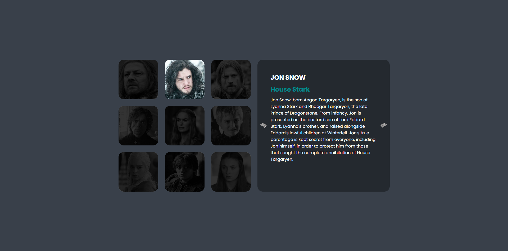

<h1 align="center"> 🌀 GoT Swiper 🌀 </h1>

### 🌐 Demo / Preview


---

### ✏️ **Description**
This is the first fully interactive project showcasing **Swiper.js**. The project focuses on dynamic interactivity, making the active character stand out with lighting effects, synchronizing the description to match the character, and ensuring smooth scrolling transitions.  

JavaScript is the key technology here, powering the interactivity and bringing the Swiper.js functionality to life.

### 💻 **Technologies Used**
- **HTML5**: For structuring the content of the page.
- **CSS3**: For styling and animations.
- **JavaScript**: For dynamic behavior and Swiper.js integration.

### **Key Features** 🚀
🎯 Character highlighting: Active character is illuminated with a smooth effect.

🔄 Synced descriptions: Descriptions dynamically update to match the character.

🌀 Swiper.js integration: Smooth scrolling and seamless transitions between characters.

🧠 Interactive JavaScript: Core focus on JavaScript to drive interactivity and synchronization.

### 🛠️ **Installation & Usage**
1. Clone the repository:
   ```bash
   git clone https://github.com/HUYBERIC/GoTSwiper.git
   cd GoTSwiper
   ```

2. Install dependencies if necessary:
   ```bash
   npm install
   ```

3. Open `index.html` in your favorite browser to view the project.

<br>
<br>
<br>

---

<h1 align="center"> 🌀 GoT Swiper 🌀 </h1>

---

### ✏️ **Description**
Ceci est le premier projet interactif mettant en avant **Swiper.js**. Ce projet se concentre sur l’interactivité dynamique : le personnage actif est illuminé avec des effets lumineux, la description sur le côté est synchronisée avec le bon personnage, et les transitions de défilement sont fluides et bien gérées.  

JavaScript est la technologie clé ici, permettant l'interactivité et exploitant les fonctionnalités de Swiper.js.

### 💻 **Technologies utilisées**
- **HTML5** : Pour structurer le contenu de la page.
- **CSS3** : Pour le style et les animations.
- **JavaScript** : Pour le comportement dynamique et l'intégration de Swiper.js.

### **Caractéristiques principales** 🚀
🎯 Mise en évidence des personnages : Le personnage actif est illuminé avec un effet fluide.

🔄 Descriptions synchronisées : Les descriptions se mettent à jour dynamiquement en fonction du personnage.

🌀 Intégration de Swiper.js : Défilement fluide et transitions harmonieuses entre les personnages.

🧠 JavaScript interactif : Accent mis sur JavaScript pour l’interactivité et la synchronisation.

### 🛠️ **Installation & Utilisation**
1. Cloner le dépôt :
   ```bash
   git clone https://github.com/HUYBERIC/GoTSwiper.git
   cd GoTSwiper
   ```

2. Installer les dépendances si nécessaire :
   ```bash
   npm install
   ```

3. Ouvrir `index.html` dans votre navigateur favori pour voir le projet.
